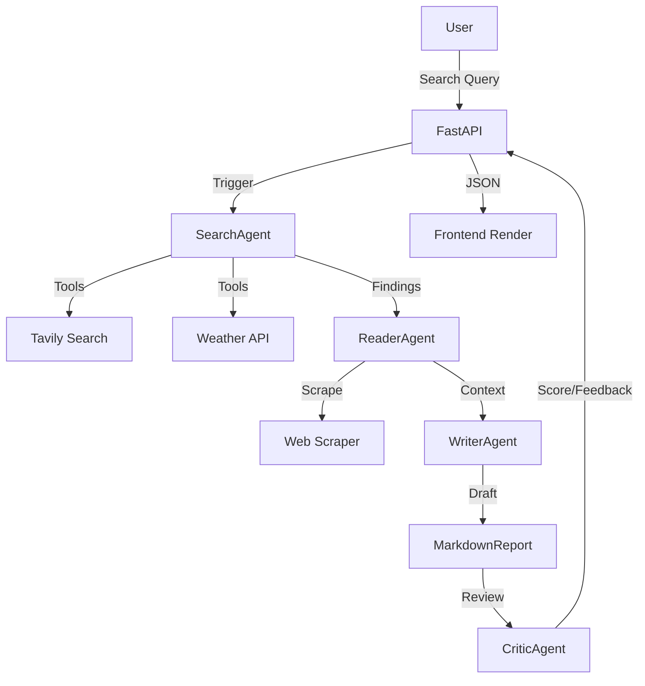

# GenAI Multi-Agent Research System

A cinematic research agent that searches the web, tracks weather, and generates deep reports.

### GenAI-Multi-Agent-Research
 Available at your primary URL https:
 ```bash
    https://genai-multi-agent-research.onrender.com
   ```


# 🌌 GenAI Multi-Agent Research Portal

A **Cinematic, AI-powered research system** that leverages multiple specialized agents to search the web, scrape content, and generate deep analytical reports with live weather integration.

Built with **FastAPI**, **LangChain**, and **Mistral AI**, featuring a premium glassmorphic UI.

---

## ✨ Features

- **Multi-Agent Orchestration**: A pipeline of Search, Reader, Writer, and Critic agents working in sync.
- **Dynamic Weather System**: Monitors climate conditions for any location searched, with animated icons (rotating sun/floating clouds).
- **Cinematic UI**: A high-end dark-mode interface with glassmorphism, background star animations, and smooth transitions.
- **Resilient AI Pipeline**: Robust retry logic to handle API timeouts and 503 errors.
- **Public-Ready**: Pre-configured for one-click deployment to platforms like Render.com.

---

## 🛠️ Project Structure

| File | Purpose |
| :--- | :--- |
| `app.py` | **The Brain (Backend)**: FastAPI server that bridges the UI and the AI pipeline. |
| `agents.py` | **Personnel**: Definitions of individual AI agents and their model configurations. |
| `pipeline.py` | **Workflow**: The logic coordinating how agents talk to each other. |
| `tools.py` | **Skills**: Python functions that agents use (Web Search, Scraping, Weather). |
| `static/` | **The Body (Frontend)**: Contains the HTML, CSS, and JS for the premium UI. |
| `.env` | **Secrets**: Storage for your private API keys (Mistral, Tavily, Weather). |

---

## 🚀 Getting Started

### 1. Prerequisites
- Python 3.10+
- API Keys for: [Mistral AI](https://console.mistral.ai/), [Tavily](https://tavily.com/), and [OpenWeatherMap](https://openweathermap.org/api)

### 2. Local Installation
1. **Clone the repository**:
   ```bash
   git clone <your-repo-url>
   cd GenAI-Multi-Agent-Research
   ```
2. **Setup Environment**:
   Create a `.env` file and paste your keys:
   ```env
   MISTRAL_API_KEY=your_key_here
   TAVILY_API_KEY=your_key_here
   WEATHER_API_KEY=your_key_here
   ```
3. **Install Dependencies**:
   ```bash
   python -m venv .venv
   source .venv/bin/activate  # On Windows: .venv\Scripts\activate
   pip install -r requirements.txt
   ```
4. **Launch the Portal**:
   ```bash
   uvicorn app:app --reload
   ```
   Visit: **`http://127.0.0.1:8000`**

---

## ☁️ Deployment (Public)

This project is optimized for **Render.com**.

1. Push your code to a **GitHub** repository.
2. Go to [Render Dashboard](https://genai-multi-agent-research.onrender.com).
3. Click **New +** -> **Blueprint**.
4. Link your Repo. Render will automatically read `render.yaml`.
5. Add your API keys in the **Environment** tab of your service.

---

## 🤖 Agent Workflow



---

## 📜 License
This project is open-source. Feel free to use and modify for your research needs!
